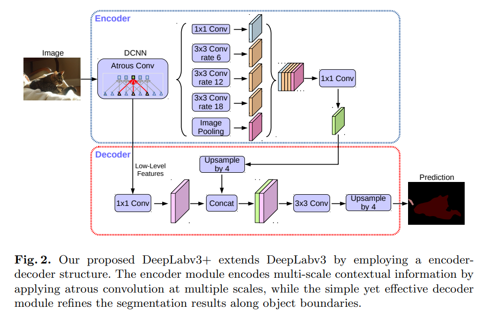

# DeepLabV3+ 说明笔记

> 个人学习笔记：DeepLab 系列发展脉络、DeepLabv3+（Encoder–Decoder + ASPP）架构要点，以及可运行的 PyTorch 模块实现。

---

## 1. 发展脉络、效果与应用

### 1.1 从 FCN 到「空洞卷积 + 多尺度上下文」

语义分割在 **FCN**（Long et al., 2015）确立全卷积范式之后，核心矛盾长期是：

- **下采样**带来大感受野与强语义，但丢失边界细节；
- **多尺度目标**（远近、大小差异巨大）难以用单一感受野覆盖。

Google 的 **DeepLab** 系列用一条清晰主线回应这一问题：

> **用 atrous（空洞）卷积控制特征分辨率与感受野，用 ASPP 并行探测多尺度上下文，再用逐步增强的解码 / 后处理恢复边界。**

它与同期的 PSPNet（金字塔池化）、U-Net（对称编解码）形成三角对照：DeepLab 更强调 **不牺牲过多分辨率的前提下扩大视野**，并在 VOC / Cityscapes 等基准上长期占据强基线位置。

### 1.2 脉络年表（精选）

| 阶段 | 代表工作 | 核心改动 | 备注 |
|------|----------|----------|------|
| 2014–15 | **DeepLabv1** | Atrous / dilated conv + DenseCRF 后处理 | 扩大感受野、细化边界；[arXiv:1412.7062](https://arxiv.org/abs/1412.7062) |
| 2016–17 | **DeepLabv2** | **ASPP**（多 rate 并行空洞卷积）+ CRF | VOC 等基准大幅抬升；TPAMI 版 [doi:10.1109/TPAMI.2017.2699184](https://doi.org/10.1109/TPAMI.2017.2699184) |
| 2017 | **DeepLabv3** | ASPP + **image-level pooling** + BN；可级联空洞；**去掉 CRF** | [doi:10.48550/ARXIV.1706.05587](https://doi.org/10.48550/arXiv.1706.05587) |
| 2018 | **DeepLabv3+** | DeepLabv3 作编码器 + **轻量 decoder**；Xception + separable atrous | 本文重点；[doi:10.48550/ARXIV.1802.02611](https://doi.org/10.48550/arXiv.1802.02611) |
| 2018 | DenseASPP | 更稠密的空洞连接 ASPP 变体 | 强化多尺度特征复用 |
| 2019 | **Auto-DeepLab** | NAS 搜索分割网络层级 / 单元 | 仍沿用空洞与多尺度思想 |
| 2019– | MobileNet / EfficientNet + DeepLabv3+ | 轻量骨干替换 ResNet/Xception | 移动端 / 实时语义分割常用配方 |
| 2020–22 | HRNet、OCR、SegFormer 等 | 另一条「高分辨率保持 / Transformer」线 | DeepLabv3+ 仍常作 CNN 强对照 |
| 2023–25 | MFA-DeepLabv3+、LGD-DeepLabv3+、SkipFormer-DeepLab、RFFLite-ASPP 等 | 轻量注意力、遥感专用模块、改进 ASPP | **仍以 v3+ 为骨架做领域增强** |

```text
FCN (2015)
  └─ DeepLabv1 ── Atrous + DenseCRF
        └─ DeepLabv2 ── ASPP + CRF
              └─ DeepLabv3 ── 增强 ASPP（含 image pooling）/ 去 CRF
                    └─ DeepLabv3+ (2018) ── Encoder(ASPP) + Decoder(浅层融合)
                          ├─ Xception / MobileNet 变体（效率）
                          ├─ DenseASPP / Auto-DeepLab（结构探索）
                          └─ 近年 MFA / LGD / SkipFormer-DeepLab …（遥感、轻量化、注意力插件）
```

### 1.3 取得的效果（如何理解「强」）

| 模型 | 典型设定 | PASCAL VOC 2012 | Cityscapes | 说明 |
|------|----------|-----------------|------------|------|
| DeepLabv2 | ResNet + ASPP + CRF | test **~79.7%** mIoU | 有竞争力 | ASPP 成为后续标配 |
| DeepLabv3 | ResNet-101，无 CRF | val 已超 v2（同设定） | — | BN + image pooling 是关键增益 |
| **DeepLabv3+** | ResNet-101 + Decoder | val 单尺度约 **78.85%**（OS=16） | — | 相对「裸 ×16 上采样」约 **+1.6** |
| **DeepLabv3+** | Xception + COCO/JFT 等 | test **89.0%** mIoU | test **82.1%** mIoU | 论文 SOTA 档，**无后处理** |

要点解读（均来自 DeepLabv3+ 论文实验）：

1. **解码器有用且便宜**：在 ResNet-101、`output_stride=16` 时，加 decoder 相对 naive ×16 上采样，val mIoU 从 77.21% → **78.85%**，约多 20B Multiply-Adds。
2. **精度–速度旋钮**：同一套权重可用 atrous 在评测时改 `eval output_stride`（16↔8）；OS=16 通常是最佳折中，OS=8 再抬一点但算力陡增。
3. **Xception + separable**：把 depthwise separable 用到 ASPP 与 decoder，Multiply-Adds 可降约 **33%–41%**，精度接近或略升。
4. **生态**：TensorFlow `research/deeplab`、PyTorch `torchvision.models.segmentation`、MMSegmentation、segmentation_models.pytorch 均内置，成为工业与学术默认 CNN 分割基线之一。

### 1.4 主要应用领域

| 领域 | 典型任务 | 为何常用 DeepLab 系 |
|------|----------|---------------------|
| **自然场景 / 街景** | PASCAL VOC、Cityscapes、驾驶感知 | 原论文主战场；多尺度 ASPP 适合远近车辆与行人 |
| **遥感** | 地物分类、建筑/道路/水体；近年 LGD / SkipFormer-DeepLab 等 | 大尺度变化 + 细边界；在 v3+ 上插插件很常见 |
| **医学影像** | CT/MRI 器官与病灶区域分割（迁移应用） | 预训练骨干 + ASPP 上下文；实务中更常选 U-Net / nnU-Net |
| **机器人 / 语义建图** | 室内外实时语义分割 | MobileNet-DeepLabv3+ 延迟友好 |
| **工业视觉** | 缺陷、表面区域分割 | 开源权重与实现成熟，易落地 |

> 实务建议：通用语义分割 CNN 基线优先 **DeepLabv3+（ResNet-50/101，OS=16）**；要速度用 **MobileNetV2/V3 骨干**；要边界再抠可开 OS=8 或多尺度推理；Transformer 时代仍建议保留 DeepLabv3+ 作对照。

---

## 2. DeepLabv3+ 架构详解

### 2.1 文献

> **Liang-Chieh Chen, Yukun Zhu, George Papandreou, Florian Schroff, Hartwig Adam.**  
> *Encoder-Decoder with Atrous Separable Convolution for Semantic Image Segmentation.* ECCV 2018.  
> DOI: [10.48550/ARXIV.1802.02611](https://doi.org/10.48550/arXiv.1802.02611) · [arXiv:1802.02611](https://arxiv.org/abs/1802.02611) · [官方 TF 实现](https://github.com/tensorflow/models/tree/master/research/deeplab)

### 2.2 设计动机（对照三类结构）

论文 Figure 1 把当时主流结构概括为：

| 结构 | 优点 | 代价 |
|------|------|------|
| **(a) Spatial Pyramid Pooling**（ASPP / PSP） | 多尺度上下文强 | 深层特征分辨率低，边界糊 |
| **(b) Encoder–Decoder**（U-Net / SegNet） | 逐步恢复空间细节 | 编码器侧多尺度上下文弱 |
| **(c) DeepLabv3+** | ASPP 编码语义 + 轻解码恢复边界；**可用 atrous 任意控制编码器分辨率** | 实现稍复杂，但仍比「全程密集空洞」省算力 |

一句话：**DeepLabv3 当编码器，再挂一个简单 decoder。**

### 2.3 总体结构（对照图）



上图（`assets/DeepLabV3+-structure.png`）即论文 **Figure 2**，蓝框为 **Encoder**，红框为 **Decoder**：

| 模块 | 作用 |
|------|------|
| **DCNN + Atrous Conv** | 骨干（ResNet / Xception）用空洞卷积控制 `output_stride` |
| **ASPP** | 1×1、rate∈{6,12,18} 的 3×3、Image Pooling 并行 → concat → 1×1 |
| **Decoder** | 高层 ×4 上采样 + 浅层 1×1 降维 → concat → 3×3 精炼 → 再 ×4 |

最终预测分辨率约为输入的 **1/4** 再插值回原图（整体等效 `output_stride=4` 的解码输出）。

### 2.4 空洞卷积与 Output Stride

二维 atrous 卷积（论文 Eq. 1）：

\[
\mathbf{y}[\mathbf{i}]=\sum_{\mathbf{k}}\mathbf{x}[\mathbf{i}+r\cdot\mathbf{k}]\,\mathbf{w}[\mathbf{k}]
\]

- \(r=1\) 退化为普通卷积；增大 \(r\) 即扩大有效感受野，**不增加参数量**。
- **`output_stride`（OS）**：输入空间尺寸 / 编码器最终特征图尺寸。分类常用 OS=32；分割常用 **OS=16 或 8**（去掉末段 stride，改为空洞）。

| 训练/评测 OS | 特征密度 | 算力 | 实务 |
|--------------|----------|------|------|
| 32 | 稀 | 低 | 快但掉点明显 |
| **16** | 中 | 中 | **默认甜点** |
| 8 | 密 | 高 | 边界更好，显存敏感 |

图中 ASPP 标注的 rate 6/12/18 对应 **OS=16** 时的典型配置；若 OS=8，rate 常同步放大为 12/24/36（感受野相对特征步长保持类似）。

### 2.5 编码器：ASPP（图上半部分）

ASPP 对骨干输出并行探测：

1. **1×1** 卷积（局部通道混合）；
2. **3×3 atrous**，rate = 6 / 12 / 18（多尺度视野）；
3. **Image Pooling**：全局平均池化 → 1×1 → 双线性拉回空间尺寸（全局上下文，源自 DeepLabv3）。

五路 concat 后再经 **1×1** 压到 256 通道，得到富含语义的 encoder 特征（图中绿色竖条）。  
可选将 3×3 换成 **atrous separable convolution**（depthwise atrous + pointwise，论文 Fig. 3），在 Xception 骨干上显著降算力。

### 2.6 解码器：浅层融合（图下半部分）

相对 DeepLabv3「把 logits 直接 ×16 双线性放大」的 naive decoder，v3+ 的做法是：

1. 将 ASPP 输出 **×4 上采样**；
2. 取骨干 **low-level**（ResNet 的 Conv2 / `layer1`，约 H/4，通道常 256/512）；
3. 对 low-level 做 **1×1，压到 48 通道**（论文消融：48 优于 8/16/64 等）；
4. **Concat** 后接 **两次 `[3×3, 256]`**（消融表明 ×2 优于 ×1/×3）；
5. 再 **×4 上采样** 得到预测。

消融结论摘要（VOC 2012 val，ResNet-101）：

- low-level 通道压缩到 **48** → 78.21%（单次 3×3 设定下最优之一）；
- **两个** `[3×3, 256]` → **78.85%**；
- 再引入 Conv3 做更 U-Net 式多级解码，收益不明显，故保持简单结构。

### 2.7 Modified Xception（可选更强骨干）

论文在 MSRA Aligned Xception 基础上再改：

1. 更深，但 Entry flow 保持较轻以省显存；
2. **所有 max-pool 换成带 stride 的 depthwise separable**，以便全程可用 atrous 控分辨率；
3. 每个 3×3 depthwise 后加 **BN + ReLU**（类 MobileNet）。

配合 separable ASPP/decoder，在 VOC / Cityscapes 上取得论文最佳数字。

### 2.8 信息流直觉

```text
Image (H×W)
  → DCNN (ResNet/Xception, atrous) ─┬─ low_level (≈H/4, C_low)
                                    └─ high (≈H/OS, 2048)
                                         → ASPP (1×1 + rates + pool) → 256
                                         → ×4 upsample
  low_level → 1×1 → 48 ──────────────────┤
                                         concat → 3×3×2 → logits
                                         → ×4 upsample → Prediction (H×W)
```

---

## 3. Python 模块实现

实现目录：[`code/deeplab/`](code/deeplab/)：

| 文件 | 内容 |
|------|------|
| `aspp.py` | `ASPPConv` / `SeparableASPPConv` / `ASPPPooling` / `ASPP` |
| `decoder.py` | `DeepLabHeadV3Plus`（浅层投影 + ASPP + 融合分类） |
| `backbone.py` | `ResNetBackbone`（ResNet-50/101，OS=8/16） |
| `deeplabv3plus.py` | 整模 `DeepLabV3Plus`、`build_deeplabv3plus` |
| `__init__.py` | 包导出 |

### 3.1 ASPP 核心（摘要）

```python
# code/deeplab/aspp.py（逻辑摘要）
branches = [
    Conv1x1_BN_ReLU(C_in → 256),
    Atrous3x3(rate) for rate in (6, 12, 18),   # 或 separable
    GAP → Conv1x1 → upsample_to_HW,             # image pooling
]
y = Conv1x1_BN_ReLU(cat(branches) → 256)
y = Dropout(0.5)(y)
```

### 3.2 解码器核心（摘要）

```python
# code/deeplab/decoder.py（逻辑摘要）
low = Conv1x1_BN_ReLU(C_low → 48)(feature["low_level"])
high = ASPP(feature["out"])
high = upsample(high, size=low.shape[-2:])      # ×4 对齐到 H/4
logits = Conv3x3×2_then_1x1(cat(low, high))
return upsample(logits, size=input_HW)          # 再 ×4 回原图
```

### 3.3 用法示例

```python
import sys
sys.path.insert(0, r".\code")

import torch
from deeplab import DeepLabV3Plus, build_deeplabv3plus

model = DeepLabV3Plus(
    num_classes=21,
    in_channels=3,
    backbone="resnet50",      # 或 "resnet101"
    output_stride=16,         # 8 更密、更耗显存
    pretrained_backbone=True,
    separable_aspp=False,     # True 时用 depthwise atrous ASPP
)

x = torch.randn(2, 3, 512, 512)
logits = model(x)             # (2, 21, 512, 512)

# 仅看骨干多尺度特征
feats = model.forward_features(x)
# feats["low_level"]: ≈ H/4；feats["out"]: ≈ H/16（OS=16）
```

灰度 / 多通道输入：

```python
# 单通道：内部复制为 3 通道再进 ResNet
m1 = DeepLabV3Plus(num_classes=2, in_channels=1, backbone="resnet50", pretrained_backbone=False)

# 其他通道数：先 3×3 stem 映到 3 通道
m4 = DeepLabV3Plus(num_classes=2, in_channels=4, backbone="resnet50", pretrained_backbone=False)
```

### 3.4 快速自检

在笔记根目录执行：

```bash
python -c "import sys; sys.path.insert(0,'code'); import torch; from deeplab import DeepLabV3Plus; \
m=DeepLabV3Plus(num_classes=10, backbone='resnet50', pretrained_backbone=False); \
y=m(torch.randn(1,3,256,256)); print(y.shape)"
```

期望输出形状：`[1, 10, 256, 256]`。

---

## 4. 小结与选用建议

1. **DeepLab 系列**沿着「空洞卷积控分辨率 → ASPP 多尺度 → 去 CRF → 加轻解码器」演进；**DeepLabv3+** 把金字塔上下文与编解码边界恢复合到同一框架。  
2. 论文在 VOC / Cityscapes 上达到当时顶尖（Xception + 预训练可达 VOC test **89.0%**、Cityscapes test **82.1%**），并因开源与 torchvision / mmseg 生态成为长期强基线。  
3. 近年大量「××-DeepLabv3+」工作（轻量骨干、遥感插件、改进 ASPP、注意力 skip）说明：**v3+ 的 Encoder(ASPP)+Decoder 接口非常适合做领域定制。**  
4. 本目录 `code/deeplab/` 提供与论文 Figure 2 对齐的可运行实现，可直接嵌入分割训练脚本。

### 参考文献

1. Chen et al., 2018. *DeepLabv3+.* [doi:10.48550/ARXIV.1802.02611](https://doi.org/10.48550/arXiv.1802.02611)  
2. Chen et al., 2017. *DeepLabv3.* [doi:10.48550/ARXIV.1706.05587](https://doi.org/10.48550/arXiv.1706.05587)  
3. Chen et al., 2016/2017. *DeepLabv2 / DeepLab.* [doi:10.1109/TPAMI.2017.2699184](https://doi.org/10.1109/TPAMI.2017.2699184)  
4. Chen et al., 2014. *DeepLabv1.* [arXiv:1412.7062](https://arxiv.org/abs/1412.7062)  
5. Chollet, 2017. *Xception.*  
6. Liu et al., 2019. *Auto-DeepLab.*  
7. Yang et al., 2018. *DenseASPP.*  
8. Liu et al., 2025. *MFA-Deeplabv3+.*  
9. 近年遥感增强：LGD-DeepLabV3+、SkipFormer-DeepLab 等。

### 延伸阅读

- TensorFlow DeepLab 官方仓库与 PASCAL / Cityscapes 预训练  
- `torchvision.models.segmentation.deeplabv3_resnet50` / `deeplabv3_resnet101`  
- MMSegmentation：`DeepLabV3` / `DeepLabV3+` 配置与 Xception 变体  
