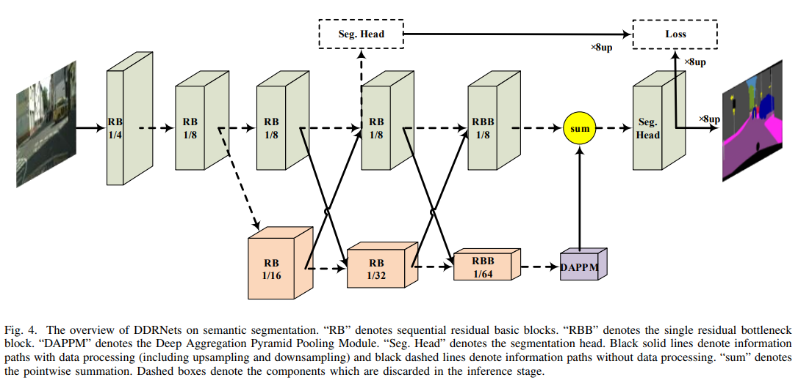

# DDRNet 说明笔记

> 个人学习笔记：多 pathway / 双分辨率实时分割脉络、DDRNet（双边融合 + DAPPM）架构要点，以及可运行的 PyTorch 模块实现。

---

## 1. 发展脉络、效果与应用

### 1.1 从「重型空洞骨干」到「多通路实时分割」

语义分割要同时满足：**大感受野的语义**与 **高分辨率细节**。早期强模型（DeepLab / PSPNet）靠 **dilation backbone** 保持较密特征，精度高但算力与延迟难进车载。

实时路线大致分两派：

| 路线 | 思路 | 代表 |
|------|------|------|
| **Encoder–Decoder** | 深编码器抽语义，解码器上采样恢复 | ENet、ERFNet、SwiftNet、SFNet |
| **Two-pathway / 多 pathway** | 一条保细节、一条抽上下文，再融合 | ICNet、BiSeNet、Fast-SCNN、**DDRNet**、PIDNet |

**DDRNet**（Hong et al., 2021）的关键判断是：

> BiSeNet 式「浅空间路径 + 深上下文路径」里，高分辨率一侧往往太浅、融合次数太少；应做成 **两条都足够深的双分辨率支路**，并在多个阶段做 **双边融合（bilateral fusion）**，再在低分辨率末端挂轻量上下文模块 **DAPPM**。

这样既继承 HRNet「深高分辨率表征」的思想，又把高分辨率支路压到约 **1/8**、通道更瘦，从而适合 **2048×1024** 级路景实时推理。

### 1.2 脉络年表（精选）

| 阶段 | 代表工作 | 核心改动 | 备注 |
|------|----------|----------|------|
| 2015–17 | FCN / DeepLab / PSPNet | 全卷积；空洞 / 金字塔上下文 | 高精度，难实时 |
| 2017–18 | ICNet、ENet、ERFNet | 级联分辨率 / 轻量编解码 | 早期实时街景 |
| 2018–19 | **BiSeNet / BiSeNetV2** | Spatial path + Context path | 双通路范式确立 |
| 2019 | Fast-SCNN、DFANet | 共享下采样 / 深度可分离聚合 | 追求更高 FPS |
| 2019–20 | HRNet | 多分辨率并行 + 反复融合 | 高精度，非专为实时 |
| 2020–21 | SwiftNet、SFNet、STDC-Seg | 预训练轻骨干 / 流对齐 / 重思 BiSeNet | 编码器–解码器侧强基线 |
| 2021 | **DDRNet** | **深双分辨率 + 多次双边融合 + DAPPM** | 本文重点；[doi:10.48550/ARXIV.2101.06085](https://doi.org/10.48550/arXiv.2101.06085) |
| 2022 | DDRNet T-ITS 扩展版 | 交通场景表述与实验完善 | [IEEE T-ITS 2022](https://doi.org/10.1109/tits.2022.3228042) |
| 2023 | **PIDNet** | 三支路（细节/上下文/边界），类 PID 防「过冲」 | 以 DDRNet 为重要对照与改进对象 |
| 2023–25 | RDRNet、各类 DDRNet 变体 | 重参数化、域适配、效率优化 | 仍常用双分辨率骨架 |

```text
Dilation 高精度骨干（DeepLab / PSP）
        │
        ├─ Encoder–Decoder 轻量化 ── ENet / SwiftNet / SFNet / STDC
        │
        └─ Two-pathway
              ├─ BiSeNet / Fast-SCNN ── 浅细节 + 深语义
              ├─ HRNet ── 多分辨率深并行（偏高精度）
              └─ DDRNet (2021) ── 深双分辨率 + 双边融合 + DAPPM
                    └─ PIDNet (2023) ── + 边界支路（三通路）
```

### 1.3 取得的效果（如何理解「强」）

论文在 **Cityscapes / CamVid** 上给出速度–精度新帕累托前沿（单卡 **2080Ti**，无 TensorRT、无 Mapillary 等额外数据时的主结果）：

| 模型 | Cityscapes test mIoU | FPS (2080Ti, 2048×1024) | Params | 定位 |
|------|----------------------|-------------------------|--------|------|
| DDRNet-23-slim | **77.4%** | **~102** | ~5.7M | 实时甜点 |
| DDRNet-23 | **79.4%** | ~37 | ~20.1M | 更高精度实时 |
| DDRNet-39 | **80.4%** | ~22 | ~32.3M | 近实时、仅 fine 标注达 80+% |

补充：

- **CamVid**：DDRNet-23-slim 约 **74.7% mIoU @ 230 FPS**（960×720）。
- 相对 BiSeNetV2 / DFANet / MSFNet 等，同速或更快时常有明显 mIoU 优势；相对 SFNet(ResNet-18) 等，可在更高速度下达到相近或更好精度。
- **可扩展性**：同一双分辨率配方加宽加深即可从 77% 推到 80%+，不像部分「为速度特化」的结构难以抬精度。

### 1.4 主要应用领域

| 领域 | 典型任务 | 为何常用 DDRNet / 双通路系 |
|------|----------|----------------------------|
| **自动驾驶 / 路景** | Cityscapes、CamVid、行车可通行区域与物体分割 | 原论文主战场；高分辨率输入下仍可实时 |
| **车载 / 边缘部署** | 舱外语义、Comma10K 等路景数据集 | slim 变体参数少、GPU 友好（少 depthwise） |
| **智能交通 / 监控** | 道路场景解析、交通参与者分割 | 精度–速度折中适合在线推理 |
| **移动机器人** | 室外导航相关的场景语义 | 延迟可控，易换输入分辨率 |
| **遥感快速分割** | 道路/建筑等需较快吞吐的地物分割 | 大图推理时偏好实时双通路结构 |

> 实务建议：实时街景先试 **DDRNet-23-slim**；要抬点用 **23 / 39**；若边界「被上下文糊掉」，可对照 **PIDNet** 三支路。训练期可开 `augment` 辅助头（权重常 0.4），推理丢掉。

---

## 2. DDRNet 架构详解

### 2.1 文献

> **Yuanduo Hong, Huihui Pan, Weichao Sun, Yisong Jia.**  
> *Deep Dual-resolution Networks for Real-time and Accurate Semantic Segmentation of Road Scenes.*  
> DOI: [10.48550/ARXIV.2101.06085](https://doi.org/10.48550/arXiv.2101.06085) · [arXiv:2101.06085](https://arxiv.org/abs/2101.06085) · [官方代码 ydhongHIT/DDRNet](https://github.com/ydhongHIT/DDRNet)

### 2.2 设计动机（对照四类结构）

论文 Figure 2 将当时结构概括为：

| 结构 | 优点 | 代价 |
|------|------|------|
| **(a) Dilation** | 密特征、大感受野 | 高分辨率卷积极贵，难实时 |
| **(b) Encoder–Decoder** | 算力友好 | 反复下采样后细节难完全恢复 |
| **(c) 经典 Two-pathway** | 细节与语义分路 | 高分辨率支路往往过浅、融合不足 |
| **(d) DDRNet** | **双支都深** + **多次双边融合** + 低分辨率 DAPPM | 实现稍复杂，但仍远快于 dilation SOTA |

### 2.3 总体结构（对照图）



上图（`../assets/DDRNet-structure.png`）即论文 **Figure 4**：

| 符号 | 含义 |
|------|------|
| **RB** | 连续 Residual Basic Blocks |
| **RBB** | 末端单个 Residual Bottleneck（扩维） |
| **实线** | 含上/下采样等处理的信息流 |
| **虚线** | 无额外处理的旁路 |
| **虚线框** | 训练用辅助 Seg Head / Loss，**推理丢弃** |

分辨率直觉：

```text
Image
  → stem（两次 stride-2）→ RB 1/4
  → RB 1/8 ──┬── 高分辨率支路（保持 ~1/8）：RB → … → RBB 1/8
              └── 低分辨率支路：RB 1/16 → 1/32 → RBB 1/64 → DAPPM
                    ↕ 多个 bilateral fusion
  → （DAPPM↑ 与高分辨率 RBB）sum → Seg Head → ×8 上采样
```

### 2.4 双边融合（Bilateral Fusion）


上图（`../assets/Bilateral fusion in DDRNet.png`）对应论文 **Figure 3** 与 Eq. 1：

- **Low → High**：低分辨率特征经 **1×1 Conv+BN** 压通道，再 **×2 双线性上采样**，与高分辨率残差输出 **逐点相加**，之后再 ReLU。  
- **High → Low**：高分辨率特征经 **3×3 Conv（stride=2）+BN** 下采样并对齐通道，再与低分辨率残差输出相加，之后再 ReLU。

要点：**先 sum，再 ReLU**（与「块内最后一层 no_relu、段末再激活」的实现一致）。  
DDRNet 在多个 stage 重复该交换，使细节支路被语义反复增强，语义支路也被空间信息校正——这是相对「只在末尾 FFM 融合一次」的 BiSeNet 的主要结构差异。

### 2.5 DAPPM（Deep Aggregation Pyramid Pooling）


上图（`../assets/DAPP module in DDRNet.png`）即论文 **Figure 5** / Eq. 2：

1. 输入为低分辨率支路末端特征（约 **1/64**）。  
2. 并行：恒等 1×1，以及 AvgPool（k=5/s=2，k=9/s=4，k=17/s=8）与 **全局池化**，各接 1×1 后上采样回原尺寸。  
3. **层级聚合**：较大尺度分支与前一尺度输出相加后再经 3×3（残差式加深），得到 \(y_1\ldots y_5\)。  
4. **Concat → 1×1 压缩**，并加 **1×1 shortcut**。

相对经典 PPM：上下文不是「一次拼完」，而是 **由浅到深、由小视野到大视野地聚合**；又因空间极小，多几层 3×3 几乎不伤 FPS。

### 2.6 分割头与深度监督

- **Seg Head**：BN-ReLU-Conv(3×3) → BN-ReLU-Conv(1×1)；中间通道 slim/23/39 常取 64/128/256。  
- **辅助头**：接在中间 1/8 高分辨率特征上，训练损失 \(L_f = L_n + 0.4\,L_a\)（同 PSPNet 习惯）；推理去掉辅助头。

### 2.7 变体规格（与 ImageNet / 分割常用配置对齐）

| 变体 | `layers` | `planes` | 分割 head 中间通道 | 典型用途 |
|------|----------|----------|--------------------|----------|
| DDRNet-23-slim | [2,2,2,2] | 32 | 64 | 最快 |
| DDRNet-23 | [2,2,2,2] | 64 | 128 | 常用 |
| DDRNet-39 | [3,4,6,3] | 64 | 256 | 更高精度 |
| DDRNet-51* | [4,6,8,4] | 64 | 256 | 工程加宽加深（非论文主表） |

\*51 为常见工程扩展配置（非论文主表）。

---

## 3. Python 模块实现

实现目录：[`../code/ddrnet/`](../code/ddrnet/)：

| 文件 | 内容 |
|------|------|
| `blocks.py` | `ConvBNReLU`、`BasicBlock`、`Bottleneck`、`SegmentHead`、`make_layer` |
| `dappm.py` | `DAPPM` |
| `ddrnet.py` | `DualResolutionNet`、`build_ddrnet`、各 `get_ddrnet_*` |
| `__init__.py` | 包导出 |

实现要点：

- 类名 **`DualResolutionNet`**（保留 `DualReslutionNet` 别名以兼容常见拼写）；
- 插值统一 **`align_corners=False`**；DAPPM / 主干分文件组织；
- **双边融合 compression 使用融合前的低分辨率特征**；
- 末次融合按论文 Fig.4 采用 **sum**（通道已对齐）；
- 变体注册表 + `build_ddrnet` 工厂函数。

### 3.1 DAPPM 核心（摘要）

```python
# ../code/ddrnet/dappm.py（逻辑摘要）
y0 = Conv1x1(x)
y1 = Conv3x3(upsample(pool5(x)) + y0)
y2 = Conv3x3(upsample(pool9(x)) + y1)
...
y4 = Conv3x3(upsample(gap(x)) + y3)
out = Conv1x1(cat(y0..y4)) + Conv1x1_shortcut(x)
```

### 3.2 双分辨率主干（摘要）

```python
# ../code/ddrnet/ddrnet.py（逻辑摘要）
x = stem → layer1 → layer2                    # 至 1/8
# 多次：
#   low  = layer3/4(low)
#   high = layer3_/4_(high)
#   low  = low + downsample(high)
#   high = high + upsample(compress(low_before_fuse))
high = layer5_(high)
ctx  = upsample(DAPPM(layer5(low)))           # 1/64 → 1/8
logits = SegHead(ctx + high) → upsample ×8
```

### 3.3 用法示例

```python
import sys
sys.path.insert(0, r"..\code")

import torch
from ddrnet import build_ddrnet, get_ddrnet_23_slim

model = build_ddrnet(
    "ddrnet23_slim",   # 或 ddrnet23 / ddrnet39 / ddrnet51
    num_classes=19,
    in_channels=3,
    augment=False,     # True：训练返回 (main, aux)
)

x = torch.randn(2, 3, 512, 512)
logits = model(x)      # (2, 19, 512, 512)

# 等价工厂
m39 = get_ddrnet_39(num_classes=19, in_c=3, augment=True)
main, aux = m39(x)
```

### 3.4 快速自检

在笔记根目录执行：

```bash
python -c "import sys; sys.path.insert(0,'../code'); import torch; from ddrnet import build_ddrnet; \
m=build_ddrnet('ddrnet23_slim', num_classes=10); y=m(torch.randn(1,3,256,256)); print(y.shape)"
```

期望输出形状：`[1, 10, 256, 256]`。

---

## 4. 小结与选用建议

1. **多 pathway 系列**从 BiSeNet 的「浅细节 + 深语义」走到 DDRNet 的「**双深分辨率 + 多次双边融合**」，再被 PIDNet 扩展为带边界支路的三通路。  
2. **DDRNet** 用 DAPPM 在 1/64 特征上廉价换取多尺度上下文，在 Cityscapes / CamVid 上取得当时顶尖的实时–精度折中（slim 约 **77.4% @ 102 FPS**）。  
3. 主应用集中在**自动驾驶、车载边缘与智能交通**等需要实时路景解析的场景。  
4. 本目录 `../code/ddrnet/` 提供与论文 Fig. 3–5 对齐的可运行实现，可直接嵌入分割训练脚本。

### 参考文献

1. Hong et al., 2021. *DDRNet.* [doi:10.48550/ARXIV.2101.06085](https://doi.org/10.48550/arXiv.2101.06085)  
2. Pan et al., 2022. *DDRNet (T-ITS).*  
3. Yu et al., 2018/2021. *BiSeNet / BiSeNetV2.*  
4. Fan et al., 2021. *STDC-Seg.* [arXiv:2104.13188](https://arxiv.org/abs/2104.13188)  
5. Xu et al., 2023. *PIDNet.* CVPR.  
6. Wang et al., 2020. *HRNet.*  
7. Zhao et al., 2017. *PSPNet*（PPM / 辅助损失惯例）。

### 延伸阅读

- 官方仓库与 Cityscapes / CamVid 预训练权重： [ydhongHIT/DDRNet](https://github.com/ydhongHIT/DDRNet)  
- MMSegmentation 等框架中的 DDRNet 配置  
- 后续对比：PIDNet 论文中对「双支路过冲」的分析与三支路改进  
