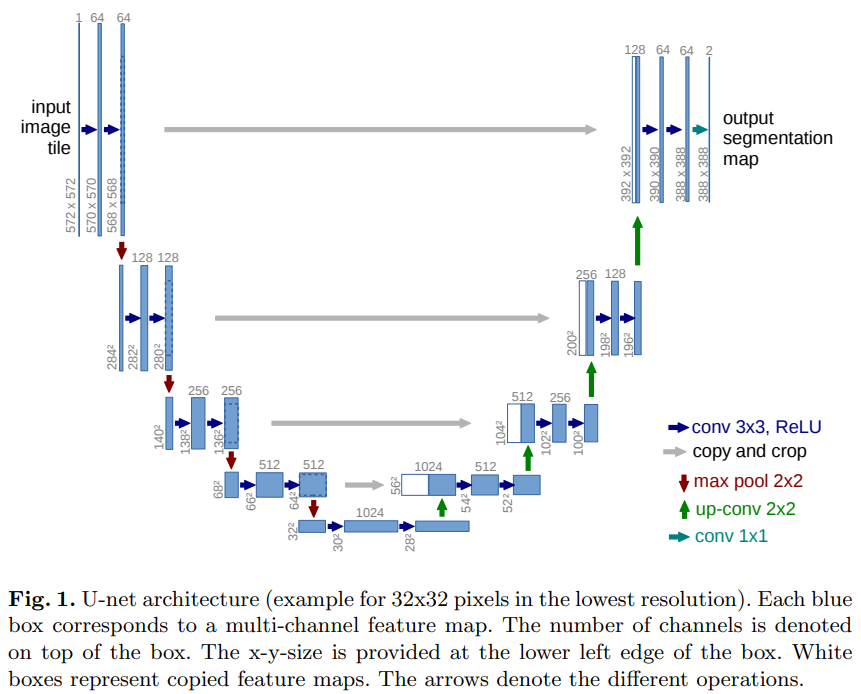
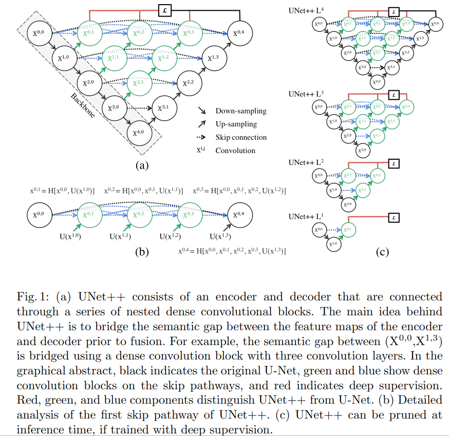

# U-Net 与 UNet++ 说明笔记

> 个人学习笔记：U 形编解码分割网络的发展脉络、U-Net / UNet++ 架构要点，以及可运行的 PyTorch 模块实现。

---

## 1. 发展脉络、效果与应用

### 1.1 从 FCN 到 U 形家族

医学与密集预测任务在 2010 年代中期迎来「全卷积」范式。**FCN**（Long et al., 2015）把分类网络改造成像素级输出，但细节恢复仍弱。同年 **U-Net**（Ronneberger et al., 2015）以对称的收缩–扩张路径 + **跳跃连接（skip connection）**，在细胞、电镜等小样本生物医学分割上取得突破，迅速成为分割领域的默认骨架。

此后十余年，「**U 形 encoder–decoder + 多尺度融合**」几乎成为分割网络的形态学公约：改 skip、改骨干、加注意力、换 Transformer，大多仍保留这张 **U shape**。

### 1.2 脉络年表（精选）

| 阶段 | 代表工作 | 核心改动 | 备注 |
|------|----------|----------|------|
| 2015 | **U-Net** | 对称 U + copy&crop skip | 原论文 ISBI 细胞/神经结构分割；DOI [10.48550/ARXIV.1505.04597](https://doi.org/10.48550/arXiv.1505.04597) |
| 2016 | 3D U-Net / V-Net | 3D 卷积；V-Net 用残差与 Dice loss | CT/MRI 体数据分割基线 |
| 2018 | **Attention U-Net** | 门控注意力加权 skip | 突出器官相关区域 |
| 2018 | **UNet++** | 嵌套稠密 skip + 深度监督 | 缩小编解码语义鸿沟；DOI [10.48550/ARXIV.1807.10165](https://doi.org/10.48550/arXiv.1807.10165) |
| 2018– | **nnU-Net** | 自配置预处理/网络/训练 | 医学分割「强基线」，多次挑战赛霸榜 |
| 2018–20 | ResUNet / MultiResUNet / DenseUNet | 残差、多分辨率块、稠密连接 | 增强梯度与多尺度表达 |
| 2020 | **UNet 3+** | 全尺度 skip + 深度监督 | 编码器各层与解码器充分交互 |
| 2021 | **TransUNet** | CNN 编码器 + ViT 建模全局 | 混合局部/全局 |
| 2022 | **Swin-UNet** | 纯 Swin Transformer 的 U 形 | 窗口注意力控制复杂度 |
| 2021–24 | SegFormer / EfficientViT-Seg 等 | 高效 Transformer / 轻量骨干 + MLP/轻解码 | 仍常保留「多尺度特征 → 上采样解码」的 U 形精神 |
| 近年 | MedNeXt、U-Mamba、各类 Mamba-UNet | 现代卷积块 / 状态空间模型嵌入 U 形 | 长程依赖与效率新折中 |

```text
FCN (2015)
  └─ U-Net (2015) ─────────────────────────────── U 形范式确立
        ├─ 3D / Attention / Res / Dense 变体
        ├─ UNet++ (2018) ── 嵌套稠密 skip
        │     └─ UNet 3+ (2020) ── 全尺度 skip
        ├─ nnU-Net ── 工程化自动配置
        └─ TransUNet / Swin-UNet / … ── Transformer 化 U 形
```

### 1.3 取得的效果（如何理解「强」）

- **U-Net（2015）**：在 ISBI 细胞追踪、神经结构分割等赛道上，以相对简单的结构超越当时多数参赛方法；其价值更在于**范式**——小数据、强数据增强、跳跃连接恢复边界，成为后续几乎所有医学分割工作的对照基线。
- **UNet++（2018）**：在多个医学数据集（如细胞核、结肠息肉、肝脏等）上相对 U-Net / 宽 U-Net 提升 Dice / IoU；论文强调两点：
  1. **嵌套稠密 skip** 让编码器浅层特征与解码器特征在语义上更「对齐」后再融合；
  2. **深度监督（deep supervision）** 使中间输出也可监督，并支持推理期 **剪枝（pruning）** 换速度。
- **nnU-Net**：在 Medical Segmentation Decathlon 等基准上长期处于顶尖，说明「U 形 + 正确的训练配方」往往比一味堆结构更重要。
- **TransUNet / Swin-UNet 等**：在 Synapse 多器官、ACDC 心脏等基准上进一步抬高 DSC、降低 HD；代价是参数量与算力上升，部署时常需权衡。

> 实务建议：新任务先用 **nnU-Net / 标准 U-Net / UNet++** 建基线，再考虑 Attention、Transformer、Mamba 等增强。

### 1.4 主要应用领域

| 领域 | 典型任务 | 为何适合 U 形 |
|------|----------|----------------|
| **生物医学影像** | 细胞、腺体、病理切片核分割 | 小样本、需精细边界 |
| **临床放射** | CT/MRI 器官与病灶（肝、肺结节、肿瘤） | 多尺度解剖结构 |
| **超声 / 内镜** | 器官边界、息肉、管腔结构 | 噪声大、对比度低，skip 保细节 |
| **遥感与遥感变化检测** | 道路、建筑、水体 | 大图块 + 精细边界 |
| **工业视觉** | 缺陷检测、表面分割 | 少样本、需可部署轻量 U-Net |
| **自然图像 / 交互分割** | 显著性、抠图、医学衍生工具 | U 形解码器仍是常用头 |

U-Net 系列在 **MICCAI、ISBI、Medical Image Analysis** 等社区引用极高；开源生态（segmentation_models.pytorch、MONAI、nnU-Net）进一步固化了其「默认分割骨干」地位。

---

## 2. U-Net 架构详解

### 2.1 文献

> **Olaf Ronneberger, Philipp Fischer, Thomas Brox.** *U-Net: Convolutional Networks for Biomedical Image Segmentation.*  
> DOI: [10.48550/ARXIV.1505.04597](https://doi.org/10.48550/arXiv.1505.04597) · [arXiv:1505.04597](https://arxiv.org/abs/1505.04597)

### 2.2 总体结构（对照图）



上图（`../assets/UNet-structure.png`）即经典 U-Net：

- **左侧收缩路径（contracting / encoder）**：重复「两个 \(3\times3\) conv + ReLU」再接 **\(2\times2\) max-pool（stride 2）**；每下采样一次，通道数通常翻倍（64→128→256→512→1024）。
- **底部瓶颈（bottleneck）**：最深层的双卷积，感受野最大、语义最强。
- **右侧扩张路径（expansive / decoder）**：每次 **\(2\times2\) up-conv（转置卷积）** 上采样并减半通道，再与左侧对应层特征 **拼接（concat）**，再接双卷积。
- **灰色横向箭头（copy and crop）**：跳跃连接。原论文使用 **valid padding**（无填充），特征图每经 \(3\times3\) 会缩小，故 skip 前需 **中心裁剪（crop）** 再拼接。
- **青色 \(1\times1\) conv**：把最终特征映射到类别数（图中示例为 2 类分割图）。

原图尺寸示例：输入 \(572\times572\)，因 valid 卷积不断丢边，输出为 \(388\times388\)（overlap-tile 策略可覆盖任意大图）。

### 2.3 信息流直觉

| 路径 | 提供什么 | 丢失什么 |
|------|----------|----------|
| Encoder 向下 | 上下文、语义 | 空间分辨率、边界细节 |
| Skip 横向 | 高分辨率、浅层纹理/边缘 | 语义较弱 |
| Decoder 向上 | 二者融合后的像素级判决 | — |

U-Net 的关键洞察：**分割既要「看懂是什么」（深语义），也要「对准在哪里」（浅层定位）**；长 skip 比单纯堆深层 FCN 更擅长后者。

### 2.4 与工程实现的常见差异

| 项目 | 原论文 | 现代常用实现（本笔记代码默认） |
|------|--------|--------------------------------|
| Padding | valid（无填充） | same（`padding=1`），输入输出同分辨率 |
| Skip | copy + crop | 直接 concat；必要时插值对齐 |
| 上采样 | \(2\times2\) 转置卷积 | 转置卷积 **或** bilinear + conv |
| Norm | 无 BN | 常加 BatchNorm / InstanceNorm |
| 输入通道 | 灰度 1 | 灰度或 RGB（1/3） |

---

## 3. UNet++ 架构详解

### 3.1 文献

> **Zongwei Zhou, Md Mahfuzur Rahman Siddiquee, Nima Tajbakhsh, Jianming Liang.** *UNet++: A Nested U-Net Architecture for Medical Image Segmentation.*  
> DOI: [10.48550/ARXIV.1807.10165](https://doi.org/10.48550/arXiv.1807.10165) · [arXiv:1807.10165](https://arxiv.org/abs/1807.10165)

后续期刊扩展版常称 *UNet++: Redesigning Skip Connections to Exploit Multiscale Features in Image Segmentation*（TMI）。

### 3.2 总体结构（对照图）



上图（`../assets/UNet++-structure.png`）分三部分：

**(a) 整体**  
节点 \(X^{i,j}\)：\(i\) 为下采样深度，\(j\) 为该深度上嵌套 skip 路径中的第 \(j\) 个卷积块。

- **黑色**：外轮廓即普通 U-Net（\(X^{*,0}\) 编码 + 最外层解码）。
- **绿色节点 + 蓝色虚线**：UNet++ 新增的 **嵌套稠密 skip**。
- **红色**：深度监督，把 \(X^{0,1},\ldots,X^{0,4}\) 接到损失 \(\mathcal{L}\)。

**(b) 顶层 skip 路径公式**（\(H[\cdot]\) 为卷积块，\(U(\cdot)\) 为上采样）：

\[
\begin{aligned}
X^{0,1} &= H\big([X^{0,0},\, U(X^{1,0})]\big) \\
X^{0,2} &= H\big([X^{0,0},\, X^{0,1},\, U(X^{1,1})]\big) \\
X^{0,3} &= H\big([X^{0,0},\, X^{0,1},\, X^{0,2},\, U(X^{1,2})]\big) \\
X^{0,4} &= H\big([X^{0,0},\, X^{0,1},\, X^{0,2},\, X^{0,3},\, U(X^{1,3})]\big)
\end{aligned}
\]

一般地（\(j>0\)）：

\[
X^{i,j} = H\Big(\big[\,[X^{i,k}]_{k=0}^{j-1},\; U(X^{i+1,j-1})\,\big]\Big)
\]

其中 \([\,\cdot\,]\) 表示通道维拼接。含义是：**同一分辨率上的历史特征全部复用（稠密）**，再与来自更深一层的上采样特征融合——逐步填平 encoder/decoder 的语义鸿沟。

**(c) 剪枝 \(L^1\sim L^4\)**  
深度监督训练后，推理可只保留到 \(X^{0,L}\)，得到更浅、更快的子网（精度–速度可调）。

### 3.3 相对 U-Net 的三点升级

1. **嵌套 skip**：不再「一次长距离 concat」，而是多级短路径渐进融合。  
2. **稠密连接**：同层 \(j\) 增大时复用 \(X^{i,0..j-1}\)，特征复用更充分（思想接近 DenseNet）。  
3. **深度监督 + 可剪枝**：训练更稳，部署可裁。

### 3.4 U-Net vs UNet++ 对照

| 对比项 | U-Net | UNet++ |
|--------|-------|--------|
| Skip | 单一长连接 | 嵌套 + 稠密多连接 |
| 语义鸿沟 | 较大（深浅直接拼） | 渐进缩小 |
| 监督 | 通常仅最终输出 | 可选多尺度深度监督 |
| 推理灵活性 | 固定全深度 | 可剪枝 \(L^1\sim L^4\) |
| 计算/显存 | 相对省 | 节点更多，更重 |
| 实现复杂度 | 低 | 中（网格 \(X^{i,j}\)） |

---

## 4. Python 模块实现

实现目录：[`../code/unet/`](../code/unet/)：

| 文件 | 内容 |
|------|------|
| `unet_blocks.py` | `ConvNormAct`、`StackedConvLayers`、`Upsampling`、中心裁剪 |
| `unet.py` | 经典 U-Net（可配 depth / BN / 转置或双线性上采样） |
| `unetpp.py` | UNet++（节点网格生成、深度监督、剪枝 \(L\)） |
| `__init__.py` | 包导出 |


### 4.1 基础块（摘要）

```python
# ../code/unet/unet_blocks.py（核心逻辑摘要）
class ConvNormAct(nn.Module):
    """Conv → Norm → Act → Dropout"""

class StackedConvLayers(nn.Module):
    """堆叠 num_layers 个 ConvNormAct（经典双卷积单元）"""

class Upsampling(nn.Module):
    """mode='transpose' | 'interpolate'（插值后再卷积改通道）"""
```

### 4.2 U-Net 用法

```python
import sys
sys.path.insert(0, r"..\code")

import torch
from unet import UNet

model = UNet(
    in_channels=1,
    num_classes=2,
    base_channels=64,  # 64-128-256-512-1024
    depth=4,
    bilinear=False,    # False=转置卷积；True=双线性+conv
    valid_padding=False,
)
x = torch.randn(2, 1, 256, 256)
logits = model(x)      # (2, 2, 256, 256)
```

前向要点：encoder 存 skip → bottleneck → 逐级 `up → cat(skip) → 双卷积` → \(1\times1\) 分类头。

### 4.3 UNet++ 用法

```python
from unet import UNetPlusPlus

model = UNetPlusPlus(
    in_channels=3,
    num_classes=2,
    filters=(32, 64, 128, 256, 512),  
    deep_supervision=True,
    prune_level=None,                 # None=满深度 L4；可设 1..4
)

x = torch.randn(2, 3, 256, 256)

model.train()
outs = model(x)   # tuple: (X^{0,4}, X^{0,3}, X^{0,2}, X^{0,1}) 的 logits

model.eval()
logits = model(x)  # 多尺度平均后的 (2, C, H, W)
```

深度监督训练时，常用加权和（与论文一致，权重可均等或偏置更深输出）：

```python
criterion = torch.nn.CrossEntropyLoss()
loss = sum(criterion(o, y) for o in outs) / len(outs)
```

### 4.4 节点网格实现要点（与论文公式对齐）

```python
# 伪代码：与 ../code/unet/unetpp.py 中 _forward_nodes 一致
feats[0][0] = H(x)                          # X^{0,0}
for i in 1..L:
    feats[i][0] = H(pool(feats[i-1][0]))    # encoder

for j in 1..L:
    for i in (L-j) .. 0:                    # 自深向浅
        parts = feats[i][0..j-1]            # 稠密：同层历史
        up = U(feats[i+1][j-1])             # 下层上采样
        feats[i][j] = H(cat(parts + [up]))
```

这与图 `(b)` 中 \(X^{0,1}\sim X^{0,4}\) 公式一一对应，只是推广到任意深度 \(i\)。

### 4.5 快速自检

在笔记根目录执行：

```bash
python -c "import sys; sys.path.insert(0,'../code'); import torch; from unet import UNet, UNetPlusPlus; \
print(UNet(1,2,32)(torch.randn(1,1,128,128)).shape); \
m=UNetPlusPlus(3,2); m.eval(); print(m(torch.randn(1,3,128,128)).shape)"
```

期望输出形状均为 `[1, 2, 128, 128]`。

---

## 5. 小结与选用建议

1. **U-Net** 用对称 U + skip 同时保留语义与定位，奠定医学分割范式。  
2. **UNet++** 用嵌套稠密 skip 缓解语义鸿沟，并用深度监督换取精度与可剪枝部署。  
3. 近年 **UNet 3+、TransUNet、Swin-UNet、nnU-Net、Mamba-UNet** 等仍多围绕 U 形演化；选型时优先基线与数据配方，再叠结构。  
4. 本目录 `../code/unet/` 提供与图示、公式一致的可运行实现，可直接嵌入分割训练脚本。

### 参考文献

1. Ronneberger et al., 2015. *U-Net.* [doi:10.48550/ARXIV.1505.04597](https://doi.org/10.48550/arXiv.1505.04597)  
2. Zhou et al., 2018. *UNet++.* [doi:10.48550/ARXIV.1807.10165](https://doi.org/10.48550/arXiv.1807.10165)

### 延伸阅读（脉络补充）

- Çiçek et al., 2016. *3D U-Net.*  
- Oktay et al., 2018. *Attention U-Net.*  
- Huang et al., 2020. *UNet 3+.*  
- Isensee et al., 2021. *nnU-Net.*  
- Chen et al., 2021. *TransUNet.*  
- Cao et al., 2021/2023. *Swin-UNet.*
