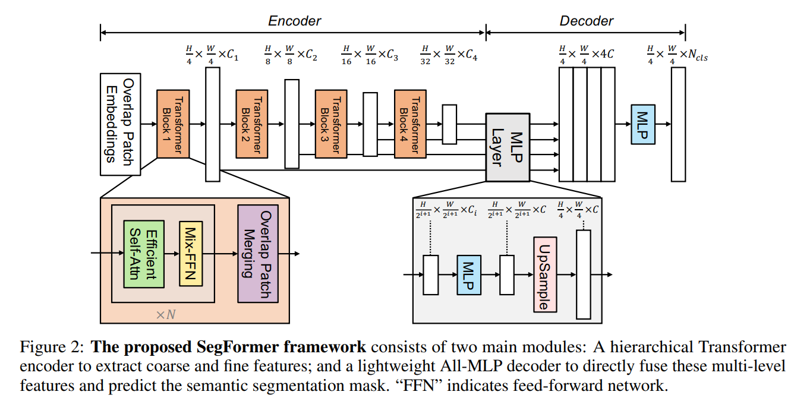

# SegFormer 说明笔记

> 个人学习笔记：SegFormer（MiT + All-MLP）发展脉络、原论文架构要点，以及可运行的 PyTorch 模块实现。

---

## 1. 发展脉络、效果与应用

### 1.1 从 FCN / SETR 到「分层 Transformer + 轻解码」

语义分割长期沿 **FCN → 强 CNN 骨干 + 重型上下文头（ASPP / PPM / OCR 等）** 演进。2020–2021 年 Vision Transformer 进入密集预测：

- **SETR**（Zheng et al.）证明可用 ViT 做分割，但单尺度低分辨率特征 + 沉重 CNN 解码器，效率差，且依赖固定形状位置编码（PE）。
- **PVT / Swin / Twins** 等把金字塔 / 窗口注意力引入骨干，改善多尺度，但多数工作仍侧重 **编码器**，解码器仍偏复杂。

**SegFormer**（Xie et al., NeurIPS 2021）的贡献可以概括成一句话：

> **用分层、无位置编码的 Mix Transformer（MiT）产出多尺度特征，再用几乎「全 MLP」的轻解码器融合局部注意力与全局注意力。**

它把「Transformer 分割」从「ViT + 重头」推进到「高效分层编码器 + 极简头」，成为后续大量工作的对照基线与设计母版。

### 1.2 脉络年表（精选）

| 阶段 | 代表工作 | 与 SegFormer 的关系 | 备注 |
|------|----------|---------------------|------|
| 2015 | FCN | 像素级全卷积范式 | 分割基石 |
| 2020 | ViT | 图像 token 化 + Transformer | 分类为主 |
| 2021 | **SETR** | 纯 ViT 编码器做分割 | 重、单尺度、依赖 PE |
| 2021 | PVT | 金字塔 Transformer 骨干 | 启发 MiT 的层次结构 |
| 2021 | **SegFormer** | **MiT + All-MLP** | DOI [10.48550/ARXIV.2105.15203](https://doi.org/10.48550/arXiv.2105.15203) |
| 2021–22 | Segmenter / MaskFormer 系 | Query / mask classification | 另一条 Transformer 分割线 |
| 2022 | **SegNeXt** | 多尺度卷积注意力 + 轻头 | 对标 SegFormer 的效率–精度 |
| 2023 | **FeedFormer** | 在 MiT 上把 All-MLP 换成特征增强 Transformer 解码 | 仍常用 MiT-B0/B2 |
| 2023–24 | **U-MixFormer** | U 形 + Mix-Attention 解码 | 相对 SegFormer / FeedFormer 再抬 mIoU |
| 2024 | **SegFormer3D** | 体积数据上的分层 ViT + All-MLP | 医学 3D 分割轻量化 |
| 2024 | **SegFormer++** 等 | Token merging / 剪枝加速 | 保持结构、压延迟与显存 |
| 近年 | SeaFormer、各类实时 / 边缘变体 | 移动端注意力 + 轻融合 | 自动驾驶、端侧部署 |

```text
ViT / SETR (单尺度 + PE + 重解码)
        │
        ├─ PVT / Swin ── 分层 / 窗口注意力骨干
        │
        └─ SegFormer (2021) ── MiT（无 PE）+ All-MLP
                ├─ SegNeXt ── 卷积注意力路线对标
                ├─ FeedFormer ── 强化 Transformer 解码
                ├─ U-MixFormer ── U 形 Mix-Attention
                ├─ SegFormer3D ── 3D / 医学体数据
                └─ SegFormer++ / 动态剪枝 ── 部署加速
```

### 1.3 取得的效果（如何理解「强」）

论文在 **ADE20K、Cityscapes、COCO-Stuff** 上给出完整 B0–B5 标尺（单模型、单尺度为主）：

| 模型 | 编码器参数 (M) | ADE20K mIoU (SS/MS) | Cityscapes mIoU (SS/MS) | 定位 |
|------|----------------|---------------------|-------------------------|------|
| SegFormer-B0 | 3.4 + 0.4 | 37.4 / 38.0 | 76.2 / 78.1 | 实时 / 边缘 |
| SegFormer-B1 | 13.1 + 0.6 | 42.2 / 43.1 | 78.5 / 80.0 | 轻量 |
| SegFormer-B2 | 24.2 + 3.3 | 46.5 / 47.5 | 81.0 / 82.2 | 常用甜点 |
| SegFormer-B3 | 44.0 + 3.3 | 49.4 / 50.0 | 81.7 / 83.3 | 高精度 |
| SegFormer-B4 | 60.8 + 3.3 | 50.3 / 51.1 | 82.3 / 83.9 | 高精 |
| SegFormer-B5 | 81.4 + 3.3 | **51.0 / 51.8** | **82.4 / 84.0** | 论文 SOTA 档 |

要点解读：

1. **精度–效率**：B4 在 ADE20K 约 **50.3% mIoU / 64M 参数**，相对当时最优方法约 **小 5×、高 2.2 mIoU**；B5 在 Cityscapes val 达 **84.0% mIoU**，相对 SETR 更快且更准。
2. **轻量端**：B0 在 Cityscapes 约 **71.9% mIoU @ 48 FPS**（论文对比 ICNet：延迟与精度双优），说明「分层 Transformer」也能做实时。
3. **鲁棒性**：在 Cityscapes-C 等扰动基准上零样本稳健性突出，适合安全关键场景讨论。
4. **解码器极轻**：B5 时 decoder 仅约占整网 **~4%** 参数——精度主要来自 MiT 的多尺度有效感受野，而非 ASPP 式重头。

后续 FeedFormer / U-MixFormer / SegNeXt 等在 ADE20K 等集上继续抬分，但 **「MiT 式分层编码器 + 轻量多尺度融合头」** 仍是常见起点；MMSegmentation、Hugging Face Transformers 均内置 SegFormer，生态成熟。

### 1.4 主要应用领域

| 领域 | 典型任务 | 为何常用 SegFormer 系 |
|------|----------|------------------------|
| **自然场景 / 街景** | ADE20K、Cityscapes、驾驶感知 | 原论文主战场；B0–B5 可按算力选型 |
| **遥感** | 地物分类、建筑/道路/水体 | 大图、多尺度目标；无 PE 利于任意分辨率推理 |
| **医学 2D/3D** | 病理切片、放射影像；SegFormer3D 等体数据变体 | 轻解码利于迁移；3D 变体相对部分 SOTA 更省参数 |
| **工业视觉** | 缺陷、表面分割 | 需可部署轻量骨干（B0/B1） |
| **多模态 / 下游** | 以 MiT 为 encoder 接自定义头 | HF / mmseg 权重丰富，易迁移 |

> 实务建议：城市场景或通用语义分割先用 **SegFormer-B2/B3 + ImageNet 预训练 MiT** 建基线；实时端侧用 **B0/B1**；要再抠边界可试 FeedFormer / U-MixFormer，或换 SegNeXt 卷积注意力路线。

---

## 2. SegFormer 架构详解

### 2.1 文献

> **Enze Xie, Wenhai Wang, Zhiding Yu, Anima Anandkumar, Jose M. Alvarez, Ping Luo.**  
> *SegFormer: Simple and Efficient Design for Semantic Segmentation with Transformers.* NeurIPS 2021.  
> DOI: [10.48550/ARXIV.2105.15203](https://doi.org/10.48550/arXiv.2105.15203) · [arXiv:2105.15203](https://arxiv.org/abs/2105.15203) · [官方代码 NVlabs/SegFormer](https://github.com/NVlabs/SegFormer)

### 2.2 总体结构（对照图）



上图（`assets/SegFormer-structure.png`）即论文 **Figure 2**，整体分为左右两块：

| 模块 | 作用 |
|------|------|
| **Hierarchical Transformer Encoder（MiT）** | 重叠 Patch Embed → 四级 Stage → 输出 \(\{F_1..F_4\}\) |
| **Lightweight All-MLP Decoder** | 四级特征各自 MLP → 上采样对齐 → Concat → MLP 融合 → 分类 |

对输入 \(H\times W\times 3\)：先按约 **\(4\times4\)** 粒度进入 Stage-1（相对 ViT 的 \(16\times16\) 更利于密集预测），四级特征分辨率约为：

\[
\frac{H}{4}\times\frac{W}{4}\times C_1,\;
\frac{H}{8}\times\frac{W}{8}\times C_2,\;
\frac{H}{16}\times\frac{W}{16}\times C_3,\;
\frac{H}{32}\times\frac{W}{32}\times C_4
\]

解码器输出分辨率为 \(\frac{H}{4}\times\frac{W}{4}\times N_{cls}\)（训练/评测时常再双线性插值到原图）。

### 2.3 编码器：Mix Transformer（MiT）

#### （1）重叠 Patch Embedding / Patch Merging

图中 Stage 之间的 **Overlap Patch Merging** 用卷积实现「重叠」合并，保留邻域连续性（非重叠 patch 会切断边界）。常用设置：

- Stage-1：\(K=7,\; S=4,\; P=3\) → \(\frac{H}{4}\)
- Stage-2/3/4：\(K=3,\; S=2,\; P=1\) → 依次 \(\frac{H}{8},\frac{H}{16},\frac{H}{32}\)

#### （2）Transformer Block = Efficient Self-Attn + Mix-FFN

图中放大的 **Transformer Block** 重复 \(N\) 次（由 B0–B5 的 `depths` 决定）：

**Efficient Self-Attention**  
标准注意力复杂度 \(O(N^2)\)。MiT 对 \(K,V\) 做序列缩减（论文 reduction ratio \(R\)；实现上常用 stride=\(R\) 的卷积，使空间边长缩 \(R\)、序列缩 \(R^2\)）。各级典型 `sr_ratio = [8, 4, 2, 1]`，对应序列缩减约 \([64,16,4,1]\)，复杂度降为约 \(O(N^2/R)\)。

**Mix-FFN（取代显式位置编码）**  
ViT 的固定 PE 在「训练分辨率 ≠ 测试分辨率」时需要插值，易掉点。SegFormer 主张分割任务可不显式加 PE，改在 FFN 中插入 \(3\times3\)（深度）卷积，利用零填充泄露位置信息：

\[
\mathbf{x}_{out}=\mathrm{MLP}\big(\mathrm{GELU}(\mathrm{Conv}_{3\times3}(\mathrm{MLP}(\mathbf{x}_{in})))\big)+\mathbf{x}_{in}
\]

这与图中 **Mix-FFN** 标注一致，也是「任意分辨率推理更稳」的关键设计。

#### （3）MiT-B0 … B5 规格

| 变体 | `embed_dims` | `depths` | `num_heads` | 典型用途 |
|------|--------------|----------|-------------|----------|
| B0 | 32, 64, 160, 256 | 2,2,2,2 | 1,2,5,8 | 最快 |
| B1 | 64,128,320,512 | 2,2,2,2 | 同上 | 轻量 |
| B2 | 64,128,320,512 | 3,4,6,3 | 同上 | 默认甜点 |
| B3 | 同上 | 3,4,18,3 | 同上 | 更深 |
| B4 | 同上 | 3,8,27,3 | 同上 | 很深 |
| B5 | 同上 | 3,6,40,3 | 同上 | 最深 / 最准 |

各级 `sr_ratios` 均为 `[8,4,2,1]`；ImageNet-1K 预训练编码器后，随机初始化 MLP 头再端到端微调。

### 2.4 解码器：All-MLP（对照图右侧）

图中右侧放大给出每个 stage 特征经 **MLP → Upsample → Concat** 的流程。对应论文 Eq. 4：

\[
\begin{aligned}
\hat{F}_i &= \mathrm{Linear}(C_i, C)(F_i),\quad i=1..4 \\
\hat{F}_i &\leftarrow \mathrm{Upsample}_{\frac{H}{4}\times\frac{W}{4}}(\hat{F}_i) \\
F &= \mathrm{Linear}(4C, C)(\mathrm{Concat}(\{\hat{F}_i\})) \\
M &= \mathrm{Linear}(C, N_{cls})(F)
\end{aligned}
\]

工程实现里，「融合用的 Linear」常写成 **\(1\times1\) Conv + BN + ReLU**（与 MMSeg / 官方一致）；分类为 \(1\times1\) Conv。  
官方默认：`C=256`（B0/B1），`C=768`（B2–B5）。

**为何这么简单还有效？**  
论文用有效感受野（ERF）分析（Figure 3）：MiT 浅层偏局部、深层高度非局部；MLP 头把四级拼在一起后，既保留 Stage-4 的全局上下文，又补回更强的局部响应——CNN 骨干上同样套 All-MLP 则受限（Stage-4 ERF 不够大），往往仍需 ASPP 等模块。

### 2.5 与 SETR 的对照

| 对比项 | SETR | SegFormer |
|--------|------|-----------|
| 编码器 | ViT（常 ImageNet-22K） | 分层 MiT（ImageNet-1K 即可） |
| 特征尺度 | 单尺度低分辨率 | 四级 \(\{1/4..1/32\}\) |
| 位置编码 | 固定形状 PE | **无 PE**，Mix-FFN 提供位置先验 |
| 解码器 | 多重 \(3\times3\) CNN 头 | **All-MLP**，参数占比极低 |
| 分辨率泛化 | PE 插值易掉点 | 测试分辨率更灵活 |

### 2.6 信息流直觉

```text
Image
  → OverlapEmbed (↓4)
  → Stage1 Attn(R=8) + MixFFN     → F1 (H/4)   局部细节
  → OverlapMerge (↓2)
  → Stage2 …                      → F2 (H/8)
  → Stage3 …                      → F3 (H/16)
  → Stage4 Attn(R=1) + MixFFN     → F4 (H/32)  强全局
  → MLP↑对齐到 H/4 → Concat → Fuse → Pred (H/4 → 可选↑原图)
```

---

## 3. Python 模块实现

实现目录：[`code/segformer/`](code/segformer/)：

| 文件 | 内容 |
|------|------|
| `layers.py` | `DropPath`、截断正态初始化（无 timm 硬依赖） |
| `mit_encoder.py` | `OverlapPatchEmbed`、Efficient Attn、Mix-FFN、`MixVisionTransformer`、`mit_b0`…`mit_b5` |
| `mlp_decoder.py` | `MLP`、`ConvModule`、`SegFormerHead` |
| `segformer.py` | 整模 `SegFormer`、预训练部分加载 |
| `__init__.py` | 包导出 |

实现要点：

- 编码器 **四级 Stage 用 `ModuleList` 循环**；
- **DWConv 使用 `groups=dim`**，与论文 depth-wise 一致；
- 解码器四级投影用 **`ModuleList`**；`upsample_output` 控制是否回到原图尺寸；
- 预训练加载兼容 `state_dict` / 常见前缀，并统计匹配数量。

### 3.1 编码器核心（摘要）

```python
# code/segformer/mit_encoder.py（逻辑摘要）
class OverlapPatchEmbed(nn.Module):
    """Conv 重叠切 patch → flatten → LayerNorm"""

class EfficientMultiHeadAttention(nn.Module):
    """sr_ratio>1 时对 K/V 做 stride 卷积降采样，再算 Attn"""

class MixFFN(nn.Module):
    """Linear → 3x3 DWConv → GELU → Linear（无显式 PE）"""

class MixVisionTransformer(nn.Module):
    """4×(patch_embed → N×Block → norm → BCHW 特征)"""
```

### 3.2 解码器核心（摘要）

```python
# code/segformer/mlp_decoder.py（逻辑摘要）
for feat, proj in zip(features, self.linear_c):
    tokens = proj(feat)                    # Linear: Ci → C
    fmap = tokens → (B, C, Hi, Wi)
    fmap = upsample(fmap, size=c1_hw)      # 对齐到 H/4
fused = Conv1x1_BN_ReLU(cat(fmaps))        # 4C → C
mask = Conv1x1(fused)                      # → Ncls
# 可选再 ×4 插值到输入分辨率
```

### 3.3 用法示例

```python
import sys
sys.path.insert(0, r".\code")

import torch
from segformer import SegFormer, mit_b2

# 完整分割模型（默认 B2，decoder embedding_dim=768）
model = SegFormer(
    num_classes=19,
    in_chans=3,
    encoder="mit_b0",       # 或 mit_b1 … mit_b5
    upsample_output=True,   # True: 输出与输入同高宽
)

x = torch.randn(2, 3, 256, 256)
logits = model(x)           # (2, 19, 256, 256)

# 仅编码器多尺度特征
feats = mit_b2(in_chans=3)(x)
# feats[i].shape: 1/4, 1/8, 1/16, 1/32
```

加载 ImageNet / mmseg 预训练（键名不完全一致时会自动部分加载）：

```python
model = SegFormer(num_classes=150, encoder="mit_b2")
model.load_pretrained(r"path/to/mit_b2.pth")  # 或完整 segformer 权重
```

### 3.4 快速自检

在笔记根目录执行：

```bash
python -c "import sys; sys.path.insert(0,'code'); import torch; from segformer import SegFormer; \
m=SegFormer(num_classes=10, encoder='mit_b0'); y=m(torch.randn(1,3,256,256)); print(y.shape)"
```

期望输出形状：`[1, 10, 256, 256]`。

---

## 4. 小结与选用建议

1. **SegFormer** 用 **分层无 PE 的 MiT** 解决 ViT/SETR 的单尺度与分辨率插值问题，用 **All-MLP** 证明「编码器感受野足够时，重型解码器不是必须」。  
2. **B0–B5** 覆盖实时到高精度；Cityscapes / ADE20K 成绩与开源权重使其成为通用语义分割强基线。  
3. 后续 **SegNeXt、FeedFormer、U-MixFormer、SegFormer3D、SegFormer++** 等或改注意力、或改解码、或走向 3D/加速，但仍多继承「多尺度分层特征 + 轻融合」的精神。  
4. 本目录 `code/segformer/` 提供与论文 Figure 2 / Eq. 3–4 对齐的可运行实现，可直接嵌入分割训练脚本。

### 参考文献

1. Xie et al., 2021. *SegFormer.* [doi:10.48550/ARXIV.2105.15203](https://doi.org/10.48550/arXiv.2105.15203)  
2. Zheng et al., 2021. *SETR.*  
3. Wang et al., 2021. *PVT.*  
4. Guo et al., 2022. *SegNeXt.*  
5. Shim et al., 2023. *FeedFormer* (AAAI).  
6. Yeom & von Klitzing, 2023/2024. *U-MixFormer.* [arXiv:2312.06272](https://arxiv.org/abs/2312.06272)  
7. Perera et al., 2024. *SegFormer3D.* [arXiv:2404.10156](https://arxiv.org/abs/2404.10156)

### 延伸阅读

- Hugging Face：`SegformerForSemanticSegmentation`  
- MMSegmentation：`Segformer` + `MixVisionTransformer` 配置  
- NVlabs 官方仓库与 ADE20K / Cityscapes 预训练权重
